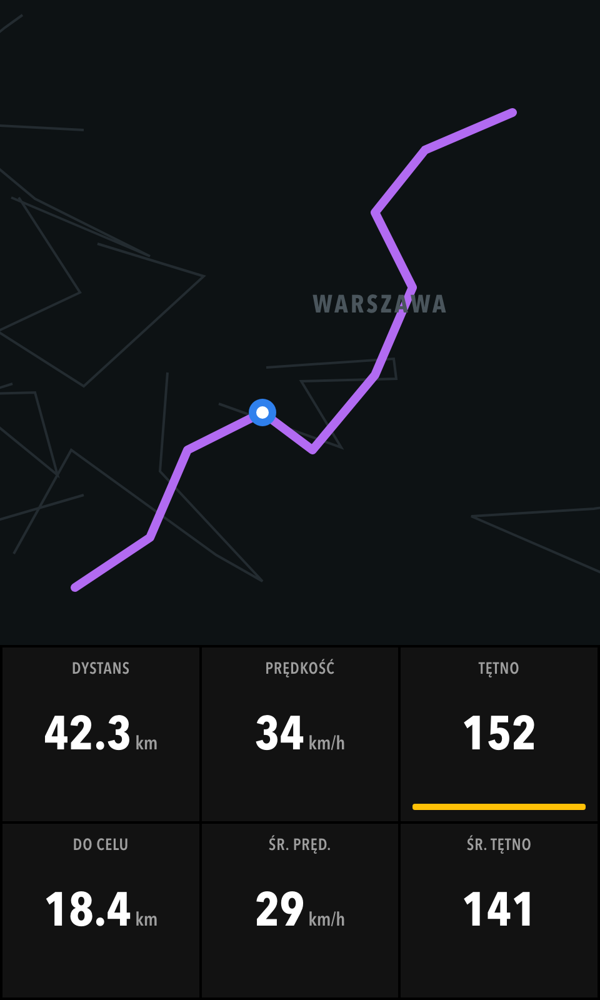
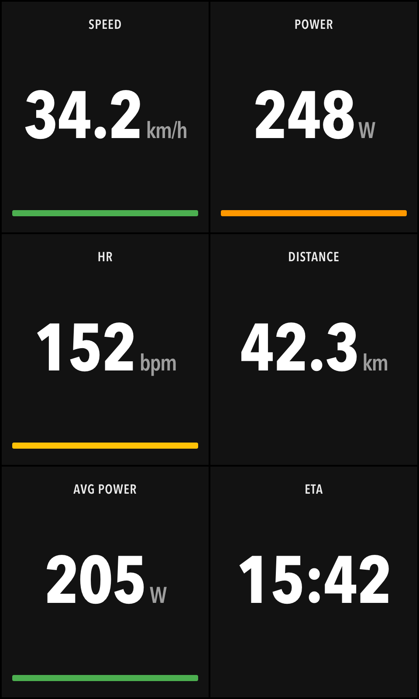
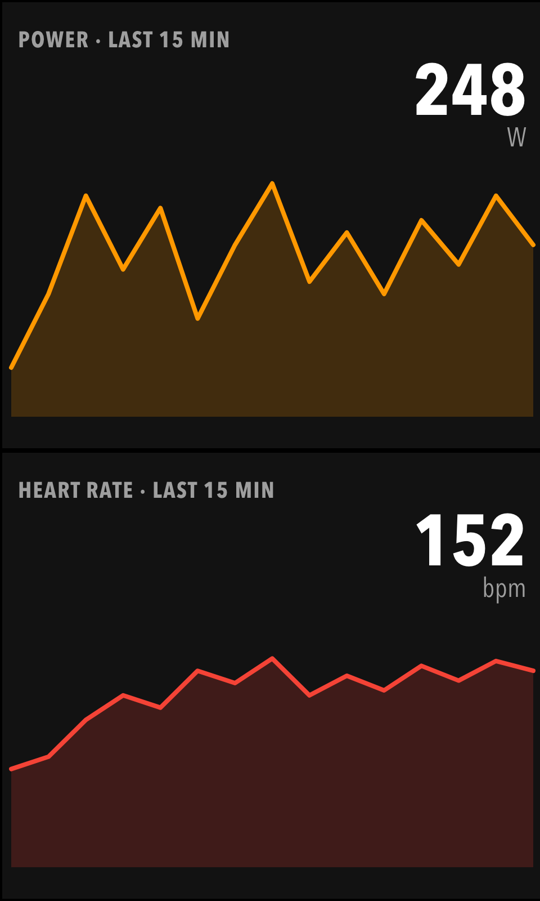
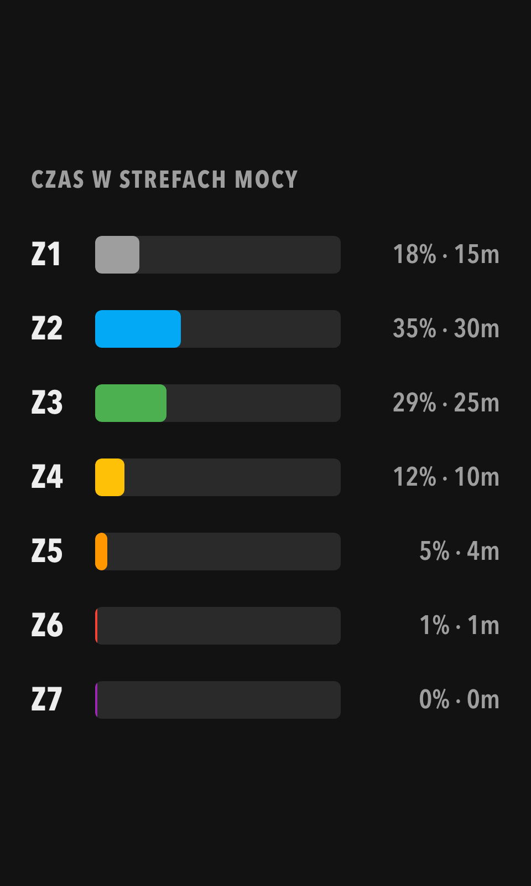
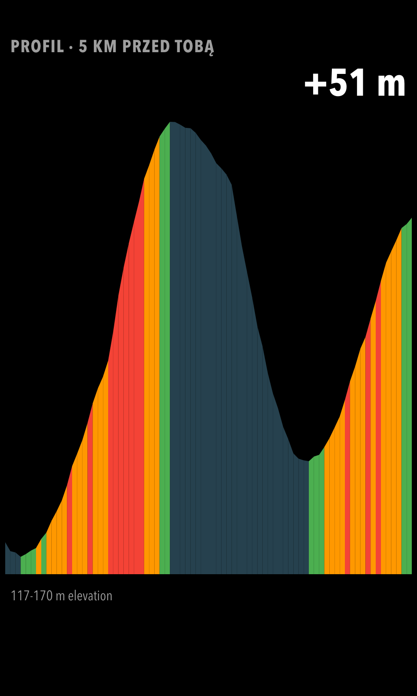

  

<h1 align="center">KarooDash</h1>

  Konfigurowalne dashboardy, wykresy treningowe, pogoda i radar opadów dla
  <b>Hammerhead Karoo</b>.

---

To repozytorium służy wyłącznie **dystrybucji** rozszerzenia KarooDash: hostuje
`manifest.json`, zrzuty ekranu i pliki APK dla Extension Library w Karoo.
Kod źródłowy jest prywatny.

## Instalacja

- **W Karoo (zalecane):** rozszerzenie pojawia się w Extension Library z opisem
  i karuzelą; kliknij **Install / Update**. Aktualizacje przychodzą automatycznie
  przez `manifest.json`.
- **Ręcznie:** pobierz najnowszy APK z [Releases](../../releases/latest) i zainstaluj
  (`adb install -r app-release.apk` albo otwórz link APK w przeglądarce Karoo).

## Funkcje

- **Ponad 90 metryk** w konfigurowalnych siatkach: prędkość, moc (IF, TSS, NP, kJ,
  30 s…), tętno i %HRR, kadencja, okrążenia, Strava Live Segments, Climber, osprzęt.
- **13 komórek-wykresów** na żywo: linie mocy/tętna/prędkości/wysokości, czas w
  strefach, pasek strefy live, łuk %FTP, profil 5 km, róża wiatru.
- **Strefy z profilu Karoo** dla tętna i mocy; własne progi kolorów dla reszty.
- **Pogoda ICON-D2** (Open-Meteo): wiatr względny, deszcz za X min, odczuwalna,
  prognoza na trasie.
- **Radar opadów** (RainViewer) 30-240 km, działa też bez WiFi (przez telefon).
- **Ekrany specjalne:** profil podjazdów, POI z ETA, radar.
- Zawsze ciemny motyw, czytelny w słońcu, obsługa w rękawiczkach.

## Zrzuty ekranu

  
  
  
  
  

## Źródła danych

Mapa © OpenStreetMap, © CARTO · Radar: RainViewer · Prognoza: Open-Meteo (ICON-D2).
Zbudowane na [karoo-ext](https://github.com/hammerheadnav/karoo-ext) (Apache-2.0, SRAM).
